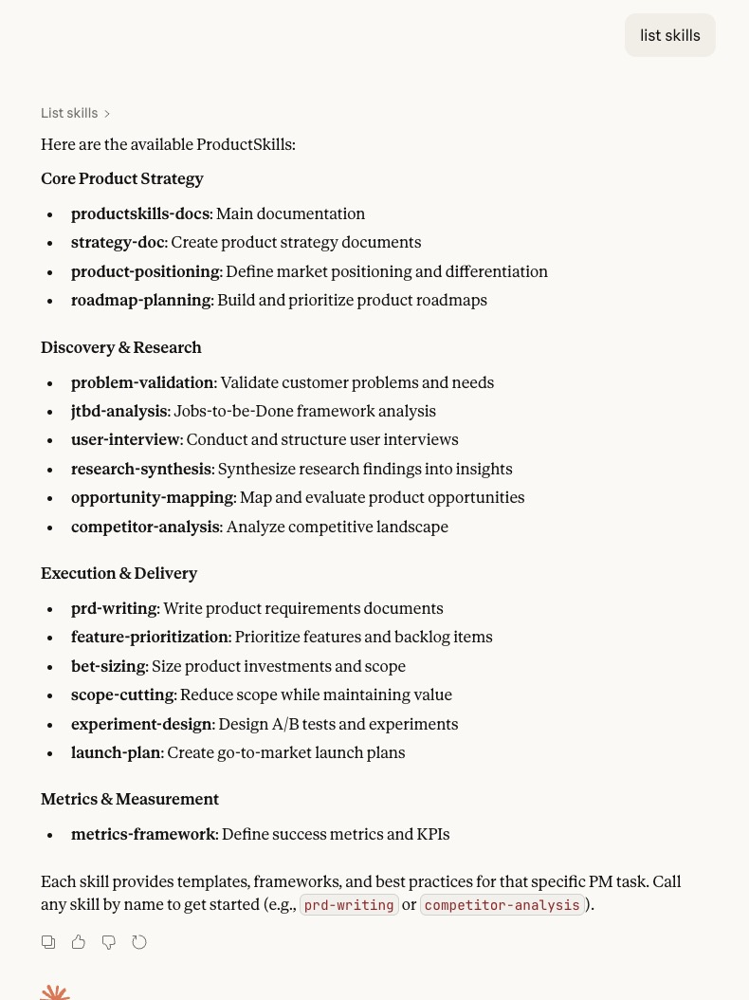
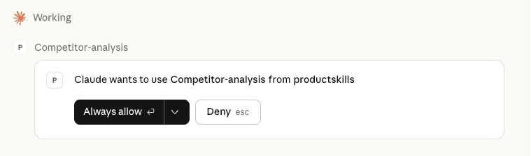
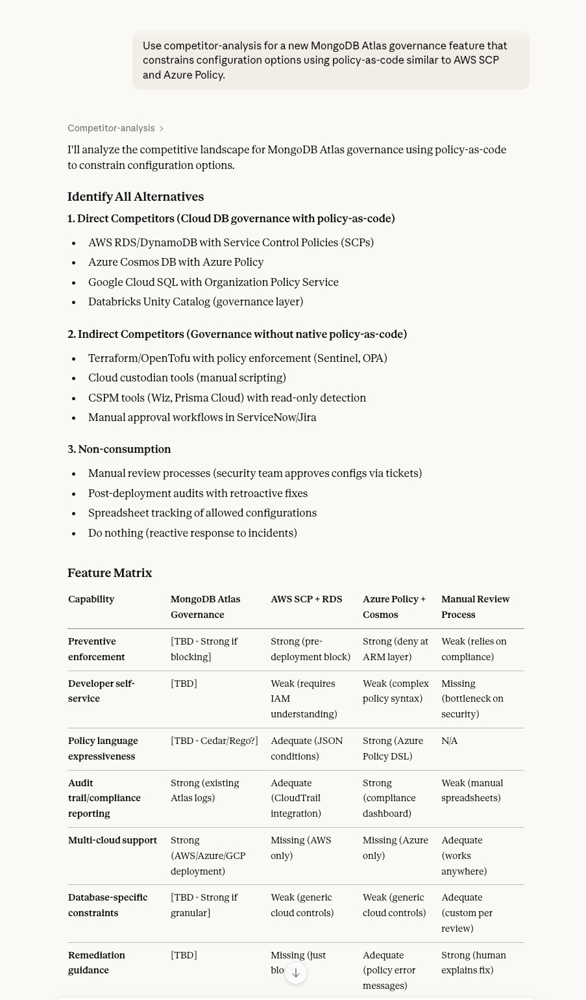

# ProductSkills MCP Integration

An MCP (Model Context Protocol) server that exposes [ProductSkills by Tair Asim](https://github.com/assimovt/productskills) as tools for Claude Desktop and other MCP-compatible clients.

**The skills in this repo are not original work.** They are sourced directly from [assimovt/productskills](https://github.com/assimovt/productskills), created by [Tair Asim](https://x.com/tair). This repo exists solely to wrap those skills in an MCP server for local use.

All core conceptual structures (e.g., capability modeling of product management work) originate from the upstream ProductSkills project. This repository **does not introduce a new skills framework**.

---

## What This Adds

The original ProductSkills repo delivers skills via CLI install, Claude Code plugin, or manual copy. This integration adds:

- **MCP server** (`productskills-mcp.js`) — exposes all skill markdown files as MCP tools, discoverable by Claude Desktop and any MCP-compatible client
- **Stable tool IDs** — each skill gets a hashed `ps_<12hex>` ID alongside a human-friendly alias (e.g. `prd-writing`, `scope-cutting`)
- **Meta-tools** — `list_skills` and `list_hashes` for discoverability

Beyond tool access, this integration operationalizes the ProductSkills model into a portable runtime layer for:
- PM execution
- Strategic narrative construction
- Interview/application responses
- Decision-support artifacts
- LLM-assisted product reasoning

---

## Setup

```bash
git clone <this-repo>
cd productskills
npm install
node productskills-mcp.js
```

Add to your Claude Desktop config (`~/Library/Application Support/Claude/claude_desktop_config.json`):

```json
{
  "mcpServers": {
    "productskills": {
      "command": "node",
      "args": ["/path/to/productskills/productskills-mcp.js"]
    }
  }
}
```

---

## Available Skills

All 16 skills are from [assimovt/productskills](https://github.com/assimovt/productskills). See that repo for full documentation, CLI install, and contribution guidelines.

| Skill | Description |
|-------|-------------|
| `user-interview` | Mom Test + YC's Five Questions |
| `problem-validation` | Frequency x Intensity x WTP scoring |
| `jtbd-analysis` | Jobs-to-be-done and Forces of Progress |
| `research-synthesis` | Atomic research: nuggets to insights |
| `opportunity-mapping` | Opportunity Solution Trees (Teresa Torres) |
| `competitor-analysis` | Feature matrix, positioning map, strategic gaps |
| `product-positioning` | April Dunford's Obviously Awesome |
| `strategy-doc` | Playing to Win + Rumelt's Strategy Kernel |
| `feature-prioritization` | RICE scoring with enablers vs blockers |
| `scope-cutting` | Shape Up appetite + scope hammering |
| `bet-sizing` | Shape Up pitch format + Type 1/2 decisions |
| `prd-writing` | Evidence-first PRDs, 800-1200 words, P0/P1/P2 |
| `launch-plan` | Launch tiers (silent / soft / big-bang) with checklists |
| `metrics-framework` | North Star + input/output tree + counter-metrics |
| `experiment-design` | Hypothesis-driven A/B tests |
| `roadmap-planning` | Now/Next/Later roadmaps — outcomes, not features |

---

## Screenshots

**Listing all available skills by category**


**Claude requesting permission to invoke a skill tool**


**The competitor-analysis skill generating a feature matrix in action**


---

## Credits

Skills created by [Tair Asim](https://x.com/tair) — [assimovt/productskills](https://github.com/assimovt/productskills), MIT License.

MCP server wrapper added separately for local integration use.
